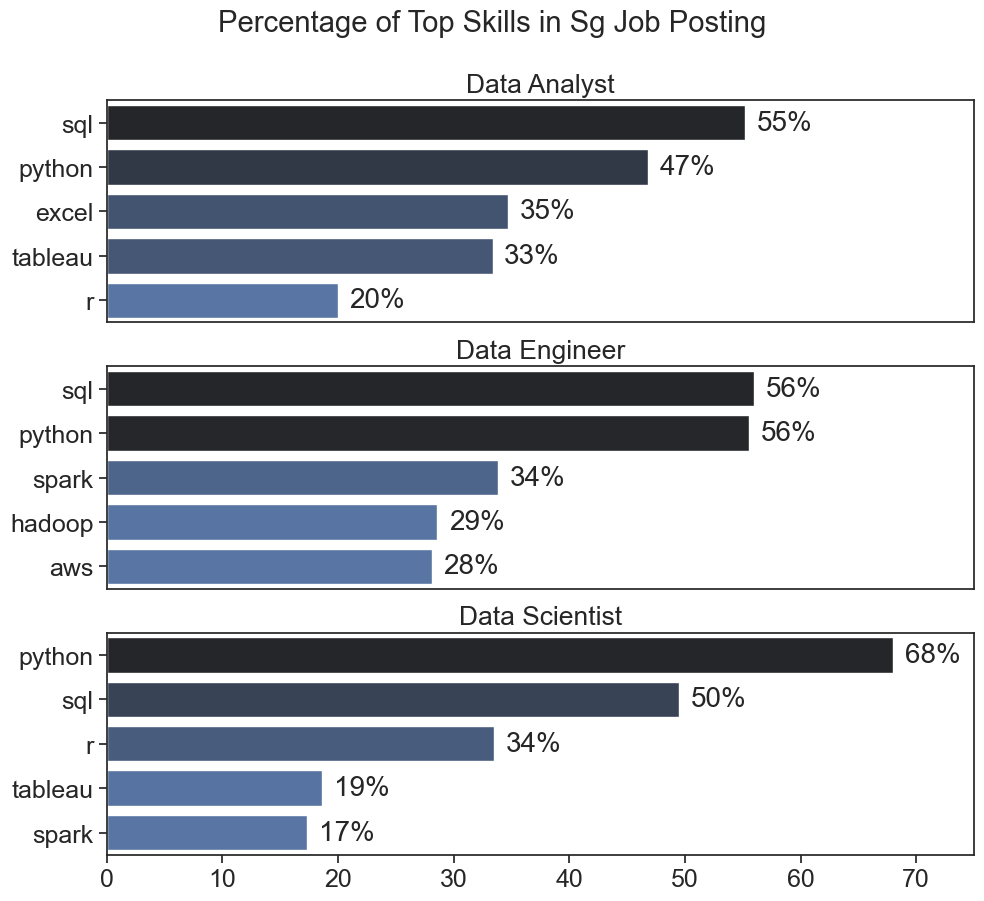
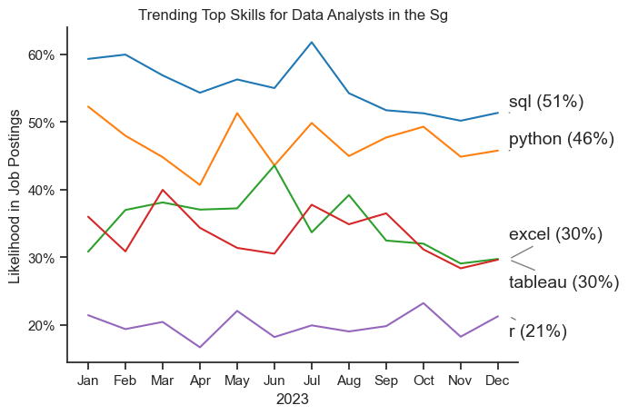
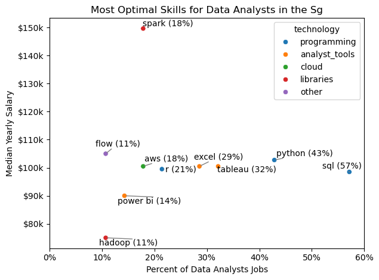

# Introduction

Welcome to my analysis of the 📊 data job market, focusing on Data Analyst roles in Singapore! 🇸🇬 This project was created out of a desire to navigate and understand the job market more effectively. 🔍 It delves into the top-paying 💰 and in-demand skills to help find optimal job opportunities for data analysts.

The data, sourced from Luke Barousse's Python course 🐍, provides a foundation for my analysis, containing detailed information on job titles, salaries, locations, and essential skills. Through a series of Python scripts 💻, I explore key questions such as the most demanded skills 📈 and the intersection of demand and salary in data analytics. 🚀

# The Questions

Below are the questions I want to answer in my project:

1. What are the most demanded skills for the top 3 most popular data roles in Singapore?

2. How are in_demand skills trending for Data Analysts?

3. What are the optimal skills for data analysis to learn? (High Demand and High Paying)

# Tools I used 

For my deep dive into the data analyst job market, I harnessed the power of several key tools:

    - Python: The backbone of my analysis, allowing me to find the data and find critical insights. I also used the following python libraries:

            - Pandas Library: This was used to analyze the data.

            - Matplotlib Library: I Visualized the data.

            - seaborn Library: Helped me create more advanced visuals.

    - Jupyter Notebooks: The tool I used to run my Python scripts which let me easily include my notes and analysis.

    - Visula Studio Code: My go-to for executing my python scripts.

    - Git & GitHub: Essential version control and sharing my Python code and analysis.

# Data Preparation and cleanup

This section outlines the steps taken to prepare the data for analysis, ensuring accuracy and usability.

### Import & Clean Up Data

I start by improting necessary libraries and loading the dataset. followed by initial data cleaning task to ensure data.

# The Analysis

## 1. What are the most demanded skills for the top 3 most popular data roles in Singapore?

To find the most demanded skills for top 3 data roles in Singapore through filtering out those positions by which ones were the most popular and got the 5 top skills for the top 3 roles. This query highlights the most popular job titles and their top skills showing
which skills I should pay attention to depending on the tole I'm targeting.

View my notebook with detailed steps here: [2_skills_count.ipynb](3_project/2_skills_count.ipynb)

### Visualize Data

```python
fig, ax = plt.subplots(len(job_titles), 1)

for index, job_title in enumerate(job_titles):
    df_plot = df_skills_count[df_skills_count['job_title_short'] == job_title].head(5)
    df_plot.plot(kind='barh', x='job_skills', y='skill_count', ax=ax[index], title= job_title)
    ax[index].invert_yaxis()
    ax[index].set_ylabel('')
    ax[index].legend().set_visible(False)

fig.suptitle('Counts of Top Skills in Job Posting', fontsize = 15)
fig.tight_layout(h_pad=1)
plt.show()
```
### Results




### Insights

SQL:

- Essential across all roles (55%-56% demand for Analysts and Engineers; 50% for Scientists).
- Core skill for querying and managing databases, crucial for data analysis, ETL processes, and dataset extraction.

Python:

- Highly demanded (47%-68%) with the most use in Data Science.
- A versatile tool for data analysis, automation, machine learning, and big data processing.

Excel:

- Key skill for Data Analysts (35% demand).
- Used for organizing, analyzing, and visualizing data, but less relevant for Engineers and Scientists.


# The Analysis

## 2. How are in_demand skills trending for Data Analysts?

To analyse the top 5 trending skills of Data Analyst in Singapore which were filtered through the month in dataframe.
Using the explode method which converted the job_skills into list that helped to seperate the data, and assigned the data to the index values. Finally we got the top 5 trending skills of Data Analyst role.

view my notebook to see my detailed steps here: [3_trending_skills.ipynb](3_project/3_trending_skills.ipynb)

### Visualize Data

```python 
df_plot = df_da_sg_perc.iloc[:, :5]

sns.lineplot(data=df_plot, dashes=False, palette='tab10')
sns.set_theme(style='ticks')
sns.despine()

plt.title('Trending Top Skills for Data Analysts in the Sg')
plt.ylabel('Likelihood in Job Postings')
plt.xlabel('2023')
plt.legend().remove()

from matplotlib.ticker import PercentFormatter
ax = plt.gca()
ax.yaxis.set_major_formatter(PercentFormatter(decimals=0))
```
### Results


### Insights

SQL (51%)

- The most consistently demanded skill across the year.
- Peaks in the middle of the year but shows a gradual decline toward December.
- Essential for querying and managing databases, making it a core skill for Data Analysts.

Python (46%)

- Maintains strong demand throughout the year with minor fluctuations.
- Slight decline in the latter half of the year.
- A versatile tool for data analysis, automation, and visualization.

- Excel (30%) and Tableau (30%)

- Both exhibit similar demand trends, with fluctuations throughout the year.
- Demand decreases slightly in the second half of the year.
- Excel is crucial for organizing and analyzing data, while Tableau is vital for creating interactive visualizations.

R (21%)

- Least demanded skill among the listed ones.
- Demand remains stable with minimal variation.
- Primarily used for statistical analysis and niche modeling tasks.

# The Analysis

## 3. What are the optimal skills for data analysis to learn? (High Demand and High Paying)

Analysing the top skills which are greater than 8% of the skill_percent of data analyst roles in Singapore with the help of pandas, which segregates the job_skills count value and compares it with a total number of job_skills count value so that we get the percentage (doing mathematical operations). Then, we plot the skills on the graph according to their related field using the for loop in the dictionary method. Finally, we get the percentage of top skills greater than 8% for data analyst roles in Singapore.

View my notebook to see the detailed steps here: [5_optimal_skills.ipynb](3_project/5_optimal_skills.ipynb)

### Visualize Data

```python from adjustText import adjust_text

# fig, ax = plt.subplots()


df_da_skills_high_demand.plot(kind= 'scatter', x= 'skill_percent', y='median_salary')

texts = []
for i, txt in enumerate(df_da_skills_high_demand.index):
    texts.append(plt.text(df_da_skills_high_demand['skill_percent'].iloc[i],df_da_skills_high_demand['median_salary'].iloc[i], txt))
    

plt.xlabel('Percent of Data Analysts Jobs')
plt.ylabel('Median Yearly Salary')
plt.title('Most Optimal Skills for Data Analysts in the Sg')
plt.tight_layout()
plt.xlim(0,60)

from matplotlib.ticker import PercentFormatter
ax = plt.gca()
ax.yaxis.set_major_formatter(plt.FuncFormatter(lambda y, post: f'${int(y/1000)}k'))
ax.xaxis.set_major_formatter(PercentFormatter(decimals=0))
```
### Results


# Insights

- SQL is the most in-demand skill, appearing in 57% of job postings with a median yearly salary of approximately $100k.
- Python is the second most sought-after skill, featured in 43% of job listings, with a median salary close to $105k.
- Tableau and Excel have significant demand at 32% and 29%, respectively, with median salaries around $100k.
- AWS (18%) and R (21%) are moderately demanded skills, offering median salaries slightly above $100k.
- Spark offers the highest median salary of approximately $150k, but it's only required in 18% of job postings.
- Hadoop and Flow have lower demand (11%) but offer salaries around $80k–$110k.
- Power BI is required in 14% of jobs, with a median salary close to $90k.

These insights suggest a strong emphasis on SQL and Python for data analysts, with specialized skills like Spark leading to higher salaries despite lower demand.

# Final Insights 

This project provided several general insights into the data job market for analysis:

    - skill Demand and Salary Correlation : There is a clear correlation between the demand for the specific skills and the salaries these skills command. Advanced and specialized skills like Python and Oracle often lead to higher salaries.

    - Market Trends: There are changing trends in skill demand, highlighting the dynamic nature of the data job market. Keeping up with these trends is essential for career growth in data analytics.

    - Economic Value of Skills: Understanding which skills are voth in-demand and well-compensated can guide data analysts in prioritizing learning to maximize their economic returns.

# Conclusion

This exploration into the data analyst job market has been incredibly informative, highlighting the critcal skills and trends that shape this evolving field. The insights I got enhance my understanding and provide actionable guidance for anyone looking to advance their career in data analytics. As the market continues to change, ongoing analysis will be essential to stay ahead in data analytics. This project is a food foundation for future explorations and underscores the importance of continuous learning and adaptation in the data field.


